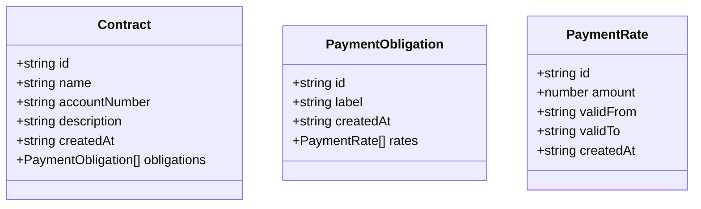
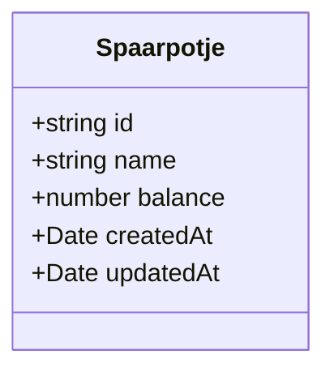

# Database Schema

All data is stored in the browser using IndexedDB. No server-side database is used.

## Object Stores

- `contracts` (keyPath: `id`) stores `Contract` objects. Read/write via `contractsRepository`.

## Example Structure

- Each `Spaarpotje` is a savings jar with a unique id, name, balance, and timestamps.
- Each `Contract` represents a recurring cost or income, with basic identity and metadata.
