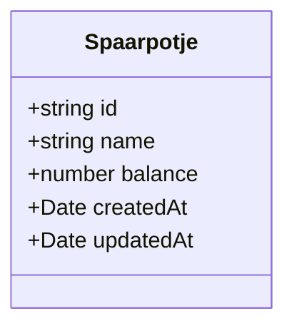

# Database Schema

All data is stored in the browser using IndexedDB. No server-side database is used.

## Example Structure

- Each `Spaarpotje` is a savings jar with a unique id, name, balance, and timestamps.
