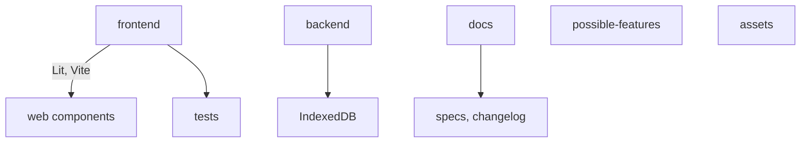

# Project Structure

- `/frontend` - Frontend code (Lit, Vite, TypeScript)
- `/backend` - (Reserved, all data in browser IndexedDB)
- `/tests` - Unit, integration, e2e, performance, benchmark tests
- `/docs` - Documentation, specs, changelog
- `/possible-features` - Feature ideas
- `/assets` - Static assets
