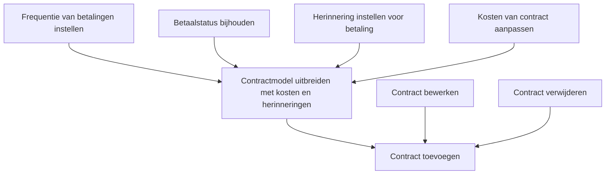

# User Story Dependencies

Below is a visual overview of the dependencies between the sprint-ready user stories voor contractbeheer in Spaarpotjes.

- Start met het realiseren van "Contract toevoegen" (#2).
- "Contractmodel uitbreiden met kosten en herinneringen" (#9) is afhankelijk van het kunnen toevoegen van contracten.
- "Contract bewerken" en "Contract verwijderen" zijn alleen afhankelijk van "Contract toevoegen".
- Alle andere stories zijn afhankelijk van het uitgebreide model.
- Deze structuur zorgt voor een logische en efficiënte workflow.

> Voor meer details, zie de individuele issues op GitHub.
> - [Contract toevoegen](https://github.com/vibe-coding/spaarpot/issues/2)
> - [Contract bewerken](https://github.com/vibe-coding/spaarpot/issues/3)
> - [Contract verwijderen](https://github.com/vibe-coding/spaarpot/issues/4)
> - [Frequentie van betalingen instellen](https://github.com/vibe-coding/spaarpot/issues/5)
> - [Betaalstatus bijhouden](https://github.com/vibe-coding/spaarpot/issues/6)
> - [Herinnering instellen voor betaling](https://github.com/vibe-coding/spaarpot/issues/7)
> - [Kosten van contract aanpassen](https://github.com/vibe-coding/spaarpot/issues/8)
> - [Contractmodel uitbreiden met kosten en herinneringen](https://github.com/vibe-coding/spaarpot/issues/9)
